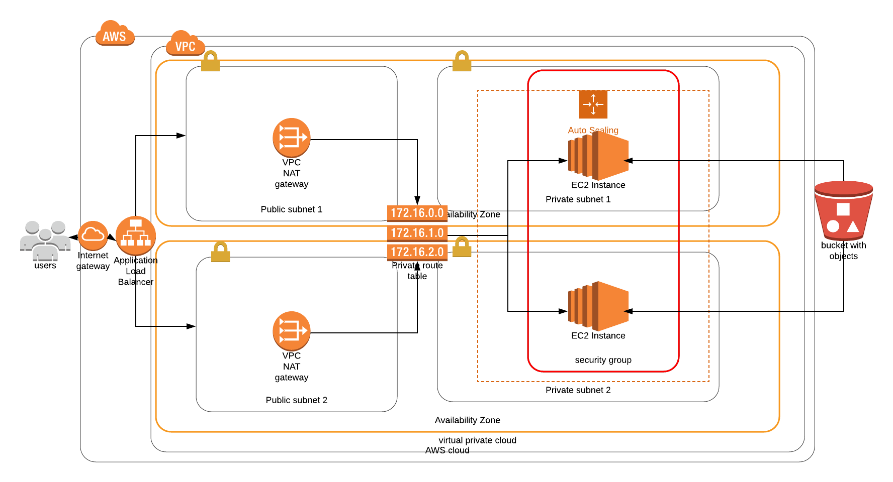

# DevOps-Project-1
## Cloud Architecture of the project

## Network and Servers
This project is divided into creating the networking and servers. First, the network, defined in `network.yml` creates a VPC, 2 public subnets, and 2 private subnets. It also contains 2 NAT Gateways to convert public traffic into private. Finally, private routing table is defined.

The server, defined in `server.yml` creates EC2 instances, with the AMI as defined in the `servers-params.json` with a minimum of 2 vCPU and 4GB of RAM for the instances created. They are protected with a Security Group and have access to call an S3 Bucket with _read only_ capabilities. 

